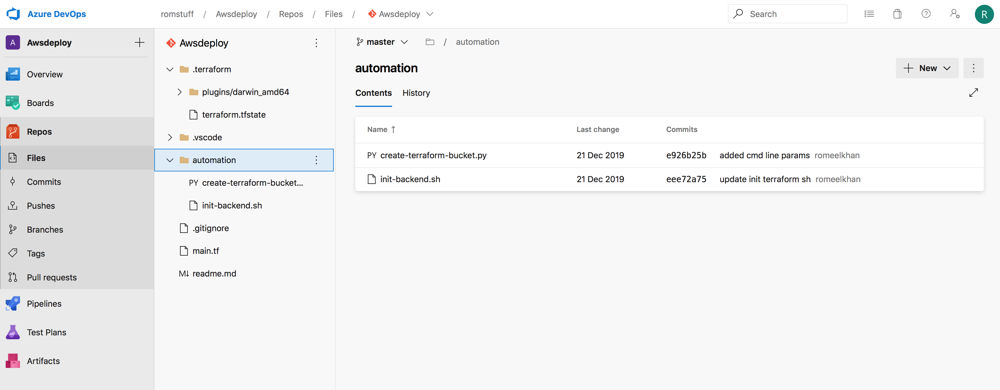
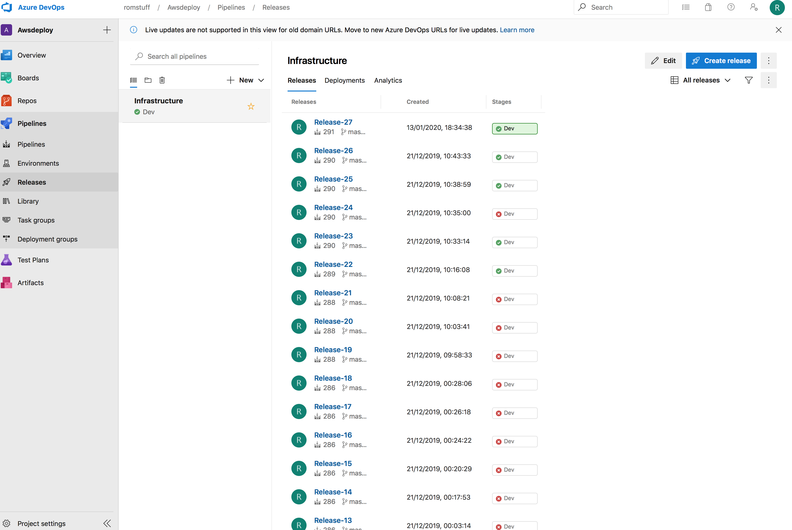
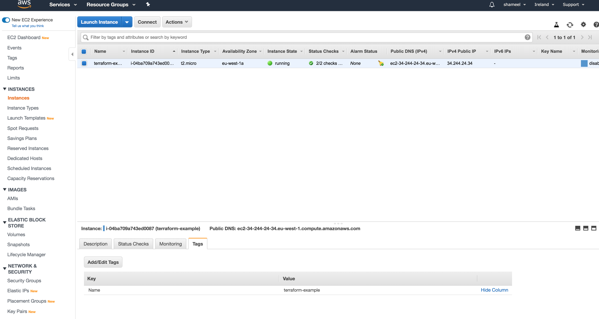
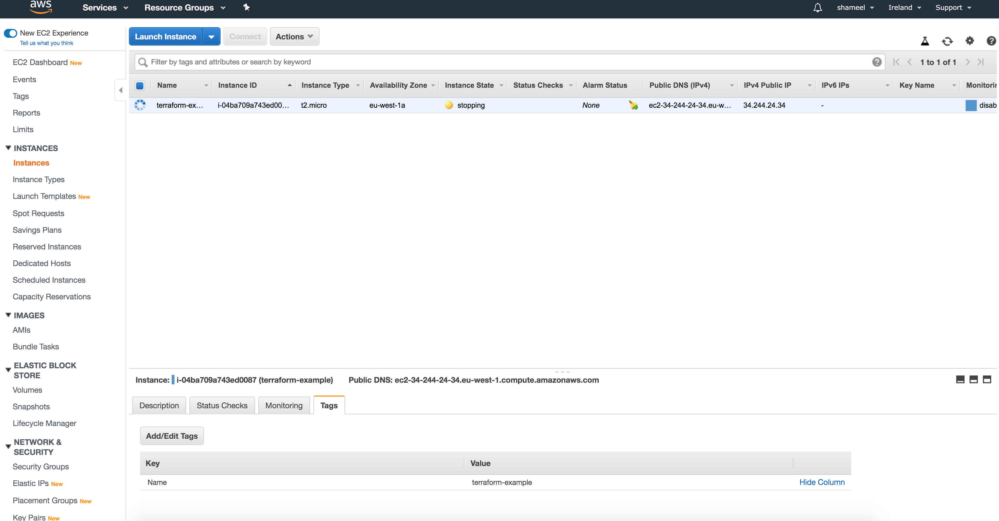

## Cloud Custodian with AWS

Following from my original article about Cloud custodian ([Intro to Cloud custodian](Readme.md). I promised to follow it up with an article with an AWS example.
In this example I use a terraform deployment of the infrastructure using Azure pipelines

### Setting up the pipeline in Azure pipelines

In my experience Jenkins has been the defacto automation tool for CI/CD pipelines into AWS. I have myself worked with Jenkins and AWS.
However, I thought I take the opportunity to implement a pipeline in Azure pipelines for the following reasons:

* Don't have to setup a Jenkins instance
* Prefer to use yaml to declare my pipelines



### Using terraform

Essentially the pipeline deploys a single instance EC2 instance to a eu-west-1 location (Ireland)

The Terraform file looks like this:

```
provider "aws" {
  region = "eu-west-1"
}

terraform {
  backend "s3" {
    bucket = "rom-terraformstate"
    key    = "global/s3/terraform.tfstate"
    region = "eu-west-1"
  }
}
resource "aws_instance" "example" {
  ami = "ami-0862aabda3fb488b5"
  instance_type = "t2.micro" 

  user_data = <<-EOF
              #!/bin/bash
              echo "Hello, World" > index.html
              nohup busybox httpd -f -p 8080 &
              EOF
  vpc_security_group_ids = ["${aws_security_group.instance.id}"]
 
  tags = {
    Name = "terraform-example"
  }
}
resource "aws_security_group" "instance" {
  name = "terraform-example-instance"
  ingress {
    from_port = "${var.server_port}"
    to_port = "${var.server_port}"
    protocol = "tcp"
    cidr_blocks = ["0.0.0.0/0"]
  }
}
variable "server_port" {
  description = "The port the server will use for HTTP requests"
  default = 8080
}
output "public_ip" {
  value = "${aws_instance.example.public_ip}"
}
```

### Terraform is great!!

I had my doubts originally about Terraform. Having deployed many instances of IaaS VMS, PaaS App Services and other resources in Azure using
ARM templates. However, I find JSON IaC code to be hard to read and is really as a data interchange format for humans and machines. So 
HCL language in Terraform provides the immediate code benefits:

* Easier to reason the IaC in a more human readable format
* Does not nest to the depths of verbose JSON


Also, one really great benefit of Terraform is it allows you to learn the concepts of other cloud providers by understanding the infrastructure
at the management plane. For me this is a revelation as my AWS learning curve has not been steep with its assistance!

Anyway, back to the focus of this article.

The Terraform file deploys the following:

* Sets the terraform state backend as a S3 bucket
* Creates an EC2 instance in a VPC
* Sets a security group with access to 8080
* Outputs the Public IP address


### AWS pipeline

By setting up a CI trigger in Azure pipelines. Every time I edit the Terraform files I expect the following to happen:

* Code is checked in trigger CI stage
* Publish the automation assets (Boto 3 S3 script file) and Terraform files
* Manually trigger release to create the infrastructure using python boto script for S3 bucket and Terraform for EC2 instance stack creation



Once the pipeline has been triggered the result is a running EC2 instance:




### Setting up Cloud custodian with AWS

Once the automated CI/CD pipeline was setup the next step was to try out a sample policy against the EC2 instance.
Keeping it simple I used the default example from the Cloud custodian site which performs following:

* Stops VM's with a tag called Name

The policy file looks like:

```
policies:
  - name: my-first-policy
    resource: aws.ec2
    filters:
      - "tag:Name": present
    actions:
      - stop
```

### Running the policy
```
custodian run --output-dir=. stop-tagged-ec2.yml 

2020-01-13 19:59:15,356: custodian.policy:INFO policy:my-first-policy resource:aws.ec2 region:eu-west-1 count:1 time:0.31
2020-01-13 19:59:15,358: custodian.actions:INFO Stop 1 of 1 instances
2020-01-13 19:59:15,715: custodian.policy:INFO policy:my-first-policy action:stop resources:1 execution_time:0.36

```

Running the policy identifies the provisioned EC2 instance with a Name tag and stops it!!!


### Clean-up

To clean up I can run:

```
terraform destroy

```
